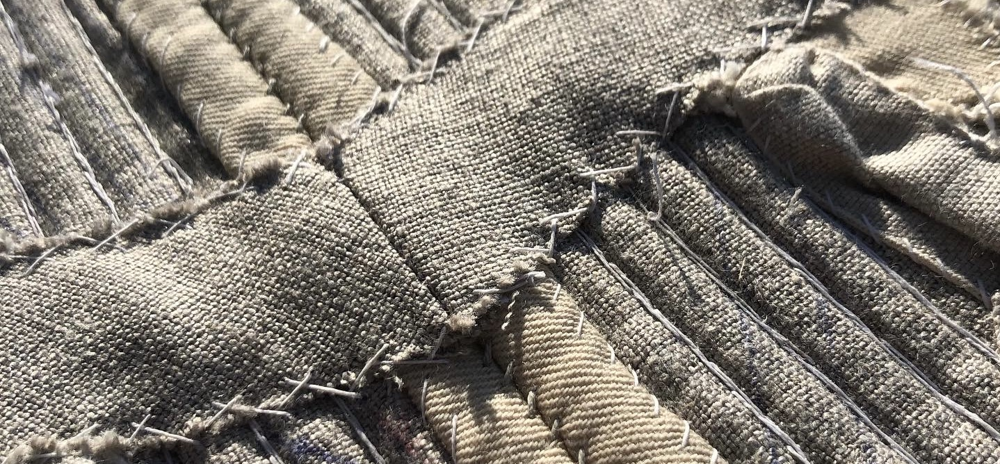

### Well, it's taking a while.

I started these stays in January 2021, when I wanted a compact handsewing project to take back to school with me. I worked pretty diligently on stitching the boning channels (aka, _100 lines of backstitching_), and finished that up in May 2021.

_Then_, I ran out of steam. I was doing so much handsewing for my job at Old Sturbridge Village that I had no interest in doing more on my own time. Fall came around and I got busy with school and costume shop work and golf and the five million other things I do during the school year.

#### tl;dr: I didn't work on these at all for a year. 

BUT, it's Short Term! Short Term is what we do at Bates in May. We get to take one intensive course, which, in my case, meets for 2 to 5 hours a day, Monday through Thursday. This funky schedule, plus the fact that my golf season ended the first weekend in May, means that I have a ton of free time this month. So, why not go back and finally finish the stays?

My biggest road block was getting the motivation to bind the tabs. Like most people I _hate_ binding tabs. It's finicky and annoying, but unfortunately necessary. Honestly, once I sat down and started working on them, they really didn't take that long. I probably took about a week to finish up the binding. 

There were also a few structural things I had to do - namely, adding a busk pocket and a reinforcement at the waist. Those were also pretty quick, and just used up some leftover linen scraps. 

### What's left to do?

Just putting in a lining! I've already finished up lining the tabs, and the body lining is pinned in. Hopefully I'll be done within the next couple days!

### Materials, Resources, References

**Fabric and thread** from [Burnley and Trowbridge](https://burnleyandtrowbridge.com/). 

**Drafting method** from [Mariah Pattie](https://youtu.be/c6dzhexyw8E).

**Other helpful references:**  
- The American Duchess Blog, especially the [boning patterns article](https://blog.americanduchess.com/2016/05/18th-century-stays-boning-patterns.html).  
- Gracie Patten's [blog](https://graciesews.wordpress.com/2020/03/29/hand-sewn-stays-from-costume-close-up-complete-worn-loved/).

