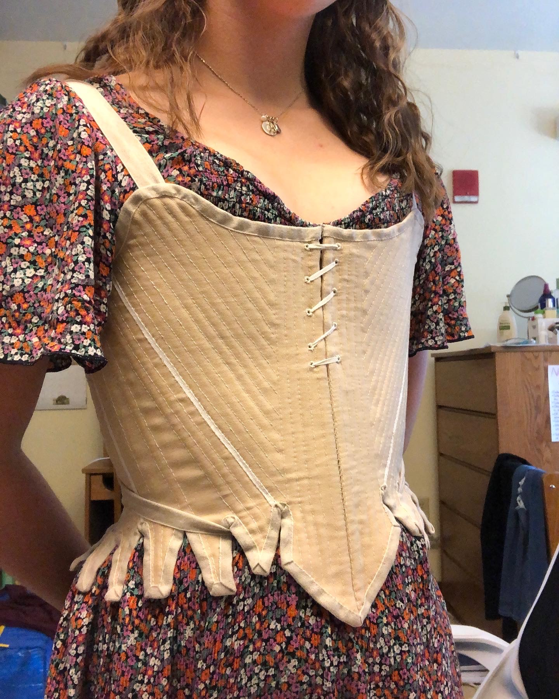
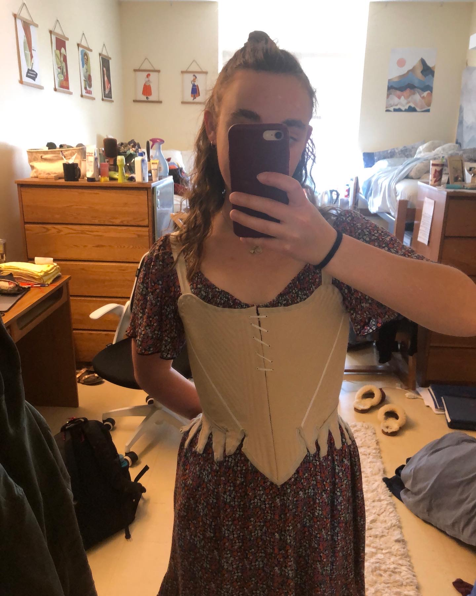

## Not just wearable - **finished**!

```{r, echo=FALSE, fig.alt="Grace wearing tan stays over a pink and orange floral dress."}

```

I'm super proud of how these turned out. It was a huge challenge to do the entire staymaking process - from drafting the pattern, to sewing boning channels, to binding tabs - entirely by myself and entirely by hand. But, it was also really rewarding. My handsewing skills have improved so much in the last year and a half, and so has my confidence in handsewing. Now I feel ready to move on to actual visible garments (and to altering some existing ones). 

### The Pattern

When I set out on this staymaking journey, I didn't initially plan on drafting the pattern myself. I really love the look of the [Augusta Stays](https://www.scrooppatterns.com/products/augusta-stays-1775-1789) by Scroop Patterns, but they're a bit later of a pattern than I wanted. I was aiming for 1770s, and the Augusta pattern is clearly the prow-front style of the 1780s. The commercial [American Duchess](https://www.americanduchess.com/collections/books-and-patterns/products/simplicity-pattern-8579-18th-century-underpinning?variant=35802379518102) pattern was closer to the shape I wanted, but I ran into sizing issues. I am not particularly squishable, and lacing down more than an inch or two irritates my ribs. In order to fit my bust measurement, the waist would've been about three inches too small - way too tight for my asthmatic lungs. 

Luckily, stays are actually super easy to draft if you think about the geometry. It's really just a matter of creating a cone-shaped base, then cutting it into pieces. The only measurements you actually need are a bust circumference, waist circumference, and the distance between the two. Mariah Pattie explains it better in her [YouTube video](https://youtu.be/c6dzhexyw8E). 

**_Hooray, math!_**

In terms of the actual pattern piece shapes and overall look, I kind of smooshed together the Augusta and American Duchess patterns, along with some extant examples. I love the look and potential adjustability of having the front lace halfway down. Down the line, I can probably fake the prow-front shape by loosening this front lacing and padding out the bust a little bit. I made the front pretty much fully-boned, but kept the sides a little bit less boned to avoid irritating my ribs too much. 

### What's up with the straps?

```{r, echo=FALSE, fig.align="center", fig.alt="The back of Grace's stays. They are spiral laced with a white cord, and tan straps form an X-shape over the lacing."}
knitr::include_graphics("stays-back.JPG")
```

I had no idea what I was doing, but I like how they turned out! I first saw this criss-cross strap style on the American Duchess stays, and was very perplexed. Every other stays pattern had the typical lace-on straps, but the criss-cross feels so much more straightforward. I just used pieces of linen tape, leftover from the binding. Later on, I might want to switch this out for a bias tape or twill-weave tape, since either of those will have a little bit more stretch, but the plain weave works fine for now. To keep the straps from crossing too high up on my neck, there is a piece of the narrower linen tape at the top of each back panel. The straps are secured by tucking them underneath the tabs, and tying them in a knot at center front. I think you can also secure them with a hook and eye on each side of the center front, but I'm going to hold off on that until I decide whether I want to switch it out for twill tape. Overall, I really like this style! It makes me hold my shoulders back in proper 18th-century posture, and is much easier to secure on myself than having to tie a bow at each shoulder. 

### Construction

I already went into a lot of detail on construction on my previous [post](https://dressing-up-data.netlify.app/blog/wip-stays/), so check that out if you want to know more!

```{r, echo=FALSE, fig.align="center", fig.alt="A mirror selfie of Grace wearing her tan stays over a pink and orange floral dress."}

```

### What's next?

Next week, I start my summer job at the Rufus Porter Museum. I'm so excited to get started! I'm also excited to have more free time than I do during the school year. I have a few projects planned for the summer, mostly in the 1770s-1780s time range. Last year I made a handsewn Italian gown, which currently has some major fit issues. My old stays had almost no shape, so the bodice of the gown is way too big. I am planning on recutting it into a zone-front, and adding more trim. I also plan on finishing the matching petticoat, which I started quite a while ago, and making a false rump to achieve the proper early-1780s silhouette. Oh, and I also currently don't have a shift of any kind because I cut my old one up, so that's kind of a must before I do much else! 

Now I just need to find things to actually get dressed up for... 
